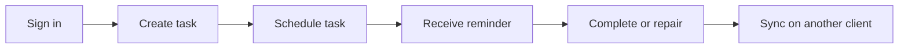
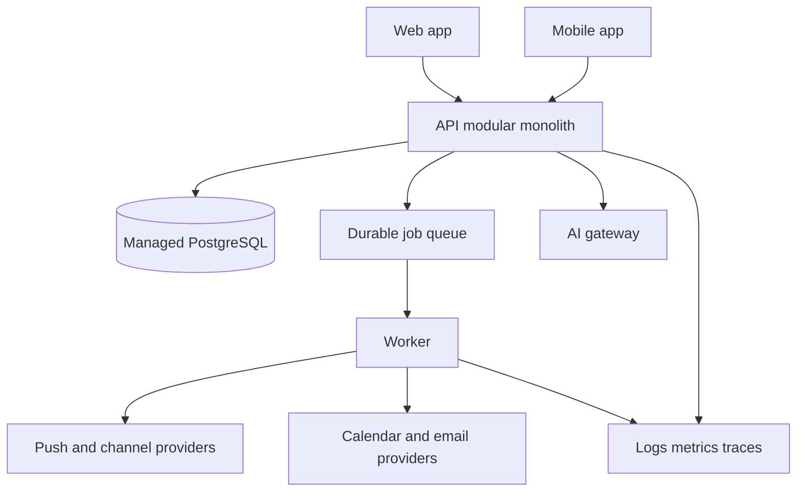

# Directive — Production Implementation Plan

**Goal:** build and deploy a production-grade Android, iOS, and web app that can support at least 10,000 monthly active users (MAU).

**Product source of truth:** [project-plan.md](project-plan.md). The earlier `v1.md` and `Project_Blueprint_v2.md` were not present on disk during the 7 September 2026 setup check; restore them before the first commit if historical copies are required.

## 1. Recommended execution order

Do not begin with every integration. First prove one complete, reliable user loop:



Run platform feasibility work in parallel with this loop because mobile blocking is the largest technical approval risk.

1. Establish ownership, accounts, source control, Jira, development conventions, and environments.
2. Prototype iOS Screen Time and Android focus controls on physical devices.
3. Build the shared task, scheduling, reminder, and synchronization foundation.
4. Release an internal alpha, then a small adult beta.
5. Add AI coaching, approved integrations, partners, and progress features behind flags.
6. Load-test, secure, observe, and deploy progressively toward 10,000 MAU.

## 2. Proposed technical architecture

This stack is the recommended default for a small team. Record any replacement as an Architecture Decision Record (ADR) before implementation.

| Layer | Choice | Reason |
|---|---|---|
| Monorepo | pnpm workspaces + Turborepo | Shared types, validation, UI tokens, and tooling |
| Web | Next.js + TypeScript | Mature application and deployment ecosystem |
| Mobile | React Native with Expo development builds | Shared TypeScript while allowing custom native modules |
| Native controls | Swift/Screen Time frameworks; Kotlin/approved Android APIs | Required for platform-specific focus controls |
| API | TypeScript, Fastify, REST/OpenAPI | Explicit contracts and a small runtime footprint |
| Database | Managed PostgreSQL | Transactions, recurrence data, audit history, and portability |
| Data access | Drizzle ORM + SQL migrations | Typed queries with reviewable migrations |
| Jobs | Managed durable queue + worker | Scheduled reminders, retries, calendar sync, and ingestion |
| Cache/rate limits | Managed Redis only when measurements justify it | Avoid unnecessary infrastructure initially |
| Authentication | Managed OIDC provider; passkeys/social login later | Do not build credential security from scratch |
| Files | Private object storage with short-lived signed URLs | Voice/evidence upload lifecycle |
| AI | Provider-neutral gateway with schemas, budgets, and evals | Model changes should not alter product rules |
| Notifications | FCM/APNs through the mobile delivery layer | Standard mobile push route |
| Observability | OpenTelemetry + error tracking + managed logs/metrics | Trace API, queue, provider, and client failures |
| Infrastructure | Terraform; separate cloud projects/accounts per environment | Repeatable, reviewable deployments |
| CI/CD | GitHub Actions with protected staging/production environments | Automated checks and controlled releases |

Use a modular monolith first: one API deployment and one worker deployment sharing domain packages. Split services only when scale, security boundaries, or team ownership produces measured pressure. Kubernetes is unnecessary for the first 10,000 MAU.



### Repository layout

```text
apps/
  web/                 Next.js application
  mobile/              Expo/React Native application
services/
  api/                 HTTP API and webhook handlers
  worker/              reminders, sync, ingestion, AI jobs
packages/
  domain/              framework-free business rules
  contracts/           OpenAPI schemas and generated clients
  db/                  schema, migrations, fixtures
  scheduler/           deterministic planning engine
  ui/                  shared tokens and cross-platform primitives
  config/              validated environment configuration
native/
  ios-focus/           Screen Time prototype/module
  android-focus/       Android focus prototype/module
infra/                 Terraform and environment configuration
docs/
  adr/                 architecture decisions
  runbooks/            operations and incident procedures
```

### Hard design rules

- The database is authoritative; clients use optimistic updates and durable synchronization IDs.
- All write requests accept an idempotency key. Webhooks and jobs tolerate duplicate delivery.
- Scheduling is deterministic. AI may extract information or propose changes but cannot bypass consent, permissions, quiet hours, or notification budgets.
- Store timestamps in UTC plus the user's IANA time-zone identifier. Calculate local schedules with daylight-saving tests.
- Use an outbox pattern so task state and reminder creation cannot diverge.
- Version public API contracts and mobile synchronization payloads.
- Feature flags control incomplete, costly, regulated, and platform-gated capabilities.
- Log metadata and correlation IDs, not private message bodies, OAuth tokens, diagnoses, locations, or evidence media.

## 3. Environments and developer setup

### Environment model

| Environment | Purpose | Data policy | Deployment |
|---|---|---|---|
| Local | Individual development | Synthetic fixtures only | Docker Compose/local processes |
| Preview | Per-pull-request web/API review | Synthetic, disposable | Automatic |
| Staging | Integration, mobile QA, migrations | Synthetic/test accounts | Automatic from main |
| Production | Real users | Production controls and retention | Protected approval |

Never copy production personal data to local, preview, or staging.

### Accounts to create

- GitHub organization and private repository.
- Jira Software project using a Scrum board.
- Cloud organization/project with billing alerts and separate staging/production projects.
- Apple Developer organization account and App Store Connect.
- Google Play Console organization account.
- Expo/EAS organization if using cloud iOS builds.
- Domain, transactional email, error tracking, product analytics, and status page accounts.
- Google and Microsoft developer/OAuth applications for staging and production.

Use organization-owned accounts, hardware-backed multi-factor authentication, at least two administrators, a password manager, and a recovery procedure. No account should depend on one founder's personal email or phone.

### Current workstation findings

Verified on 7 September 2026:

- Node.js 24.18.0, npm 12.0.2, and Git 2.54.0 are installed.
- Docker Desktop 29.4.0 is running.
- WSL has Ubuntu and Docker Desktop distributions.
- Android Studio and an Android SDK are installed.
- Android Studio includes JDK 21; the general PATH currently resolves Java 8, so project scripts must select JDK 21 explicitly.
- The folder is a Git/Github repository.
- A Mac and physical iPhone are still needed for dependable iOS native development and device verification. Cloud builds help CI but do not replace physical-device testing.

### Bootstrap checklist

1. Confirm GitHub organization/repository, Jira site, cloud provider, budget, team roles, and Mac/iPhone availability; restore the two original blueprint files if historical copies are required.
2. Initialize Git with `main`; add branch protection after pushing to GitHub.
3. Add `.editorconfig`, `.gitattributes`, `.gitignore`, pinned Node/pnpm versions, linting, formatting, type checking, and commit hooks.
4. Scaffold the monorepo and the repository layout above.
5. Add Docker Compose for PostgreSQL and the local queue/emulator dependencies.
6. Add `.env.example`; validate configuration at process startup. Never commit secrets.
7. Add one-command scripts: `setup`, `dev`, `test`, `lint`, `typecheck`, `db:migrate`, and `db:seed`.
8. Create staging and production infrastructure through Terraform.
9. Configure CI for install, lint, typecheck, unit/integration tests, build, dependency review, and secret scanning.
10. Write onboarding instructions and verify them on a second machine/account.

## 4. Jira operating model

Use the key `DIR` if available. Use Initiative → Epic → Story/Task → Sub-task. The starter CSV in this repository provides epics and initial tasks without assuming Jira-specific hierarchy mappings.

### Workflow

```text
Backlog → Ready → In Progress → In Review → QA → Ready for Release → Done
                           ↘ Blocked ↗
```

Definitions:

- **Ready:** acceptance criteria, design/API contract, dependencies, estimate, and owner are present.
- **Done:** reviewed, tested, documented, observable, accessible where relevant, deployed to the intended environment, and accepted by the product owner.
- Bugs use severity `S0` through `S3`. S0/S1 work interrupts the sprint.
- Two-week sprints; weekly backlog refinement; short daily coordination; sprint review and retrospective.
- Pull requests should be small, linked to Jira, reviewed by another person, and green in CI.

Recommended components: Product, Design, Web, Mobile, Backend, Platform, AI, Integrations, Security, QA. Labels should describe cross-cutting concerns such as `privacy`, `accessibility`, `cost`, `ios`, `android`, and `experiment`, rather than duplicate components.

## 5. Milestones and exit criteria

Dates begin when the team, repository, and required accounts are available. Estimates assume 2–4 capable builders and should be recalibrated after the first two sprints.

| Milestone | Indicative duration | Outcome and exit criteria |
|---|---:|---|
| M0 Foundation | 1–2 weeks | Repo, Jira, CI, local setup, environments, ADRs, threat model, product analytics plan |
| M1 Risk prototypes | 2–4 weeks, parallel | Physical-device focus prototypes; notification reliability spike; entitlement/policy applications started; scheduler benchmark |
| M2 Vertical slice | 4–6 weeks | Sign in, create/schedule/remind/complete/repair, offline queue, cross-client sync, staging deployment |
| M3 Internal alpha | 4–6 weeks | Today/Inbox/Plan/Coach shell, recurring tasks, quiet hours, Boss Mode, telemetry, support/admin tools |
| M4 Closed beta | 6–8 weeks | 100–500 adults, AI starting help, calendars, voice capture, weekly review, controlled experiments |
| M5 Release candidate | 4–6 weeks | Approved integrations/controls, partners, billing, accessibility, security review, store assets, load and recovery tests |
| M6 Production rollout | 2–4 weeks | 1% → 10% → 50% → 100% rollout with rollback gates; grow toward 10,000 MAU |

Avoid promising a calendar date until M0 and M1 finish. A reasonable first planning range is roughly 5–8 months for a production release with this team, excluding approval delays and assuming disciplined scope.

### Vertical-slice acceptance

- A user signs in on web/mobile, creates a task, and sees it on the other client.
- The scheduler places it inside allowed hours and explains the placement.
- A durable job sends one reminder; retries cannot duplicate the visible notification record.
- Completing, pausing, or repairing the task cancels pending follow-ups.
- Quiet hours and daily/per-task budgets are enforced without an AI call.
- Offline completion synchronizes safely after reconnection.
- Errors carry correlation IDs and appear in staging observability.

## 6. Capacity and production targets

Treat 10,000 MAU as a product target, not a difficult compute threshold. Reminder bursts, provider limits, and AI spend matter more than average HTTP traffic.

Initial planning assumptions to validate in beta:

| Load assumption | Starting value |
|---|---:|
| MAU / daily active users | 10,000 / 3,000 |
| Peak concurrent interactive users | 300 |
| API requests per daily active user | 100/day |
| Scheduled notification attempts | Up to 12/user/day hard product ceiling; model typical use separately |
| Peak API target | 50 requests/second sustained, 150 requests/second burst |
| Reminder dispatch target | 100 jobs/second with provider-specific rate limits |

These values include safety margin and are hypotheses for load tests. Replace them with measured p50/p95/p99 usage before production sizing.

### Service objectives

- API availability: 99.9% monthly after general availability.
- Read/write API latency: p95 under 400 ms, excluding third-party and AI calls.
- Reminder enqueue: p99 within 60 seconds of intended time; separately measure downstream provider delivery.
- Reminder success: at least 99.9% accepted by the configured provider, excluding invalid/revoked destinations.
- Data objective: RPO ≤ 5 minutes and RTO ≤ 60 minutes after general availability.
- Crash-free mobile sessions: ≥99.5% during beta, ≥99.8% at general availability.

Run load tests against staging with realistic burst timing. Test queue duplication, provider timeouts, database failover/restore, daylight-saving transitions, revocation, and rollback. A managed queue may deliver a job more than once, so idempotency is mandatory.

## 7. Security, privacy, quality, and operations gates

Before collecting real user data:

- Complete a lightweight threat model and data inventory.
- Define retention periods and deletion behavior for every sensitive record.
- Use least-privilege access, short-lived CI identity federation, secret rotation, encryption, and audit logs.
- Add dependency, secret, static-analysis, and container scanning to CI.
- Add API authorization tests for every resource-owner and partner-sharing boundary.
- Test prompt injection from email and messages; model output never grants authorization.
- Perform an independent penetration test before general availability.
- Prepare privacy policy, terms, consent records, support contacts, incident response, breach response, and data-subject request procedures with qualified counsel.
- Complete Google OAuth verification/security requirements before unrestricted Gmail ingestion.
- Obtain Apple entitlement and Google Play policy acceptance before advertising native blocking.

Operational readiness requires dashboards for API health, database saturation, job lag/age, reminder outcomes, provider errors, AI latency/cost, mobile crashes, and sync conflicts. Configure paging only for actionable failures. Maintain runbooks for provider outage, stuck queue, database restore, compromised credential, bad migration, notification storm, and AI kill switch.

Every production migration uses expand → deploy → backfill → contract. Test restoration at least quarterly. Production releases require an owner, change note, dashboards, rollback method, and post-release observation window.

## 8. Product validation gates

Do not scale paid acquisition until the core loop demonstrates useful follow-through. During the four-week beta from the product plan, segment working adults, adult students, and forgetfulness-focused users.

Promote from closed beta only when:

- Reminder and synchronization reliability meet the beta targets.
- No unresolved S0/S1 security, privacy, data-loss, or unwanted-contact defect exists.
- Users can pause, unlock, disconnect integrations, export, and delete without support intervention.
- At least one target segment shows improved commitment completion or faster starts without an unacceptable increase in reported pressure.
- Typical and heavy-user contribution-margin models support the proposed paid plan.
- Support load and partner-sharing complaints are understood.

## 9. Immediate next actions

### Founder/account actions

1. Initialize and push the repository; configure Jira and GitHub integration.
2. Import [jira-backlog.csv](jira-backlog.csv), then add hierarchy in Jira.
3. Create ADR-001 for the stack and ADR-002 for deployment region/data residency.
4. Scaffold the monorepo and local environment.
5. Build the vertical slice and native feasibility prototypes.
6. Review results after two sprints and revise estimates, costs, and scope.

## 10. Sources for current technical assumptions

- [Expo development builds](https://docs.expo.dev/develop/development-builds/introduction/)
- [Expo build setup](https://docs.expo.dev/build/setup/)
- [Expo native modules](https://docs.expo.dev/modules/overview/)
- [GitHub protected deployment environments](https://docs.github.com/en/actions/reference/workflows-and-actions/deployments-and-environments)
- [Cloud Run scaling and maximum instances](https://docs.cloud.google.com/run/docs/configuring/max-instances)
- [Cloud Tasks duplicate delivery and queue behavior](https://docs.cloud.google.com/tasks/docs/common-pitfalls)
- [Cloud SQL high availability and recovery](https://docs.cloud.google.com/sql/docs/postgres/high-availability)
- [Jira CSV import guidance](https://support.atlassian.com/jira-cloud-administration/docs/import-data-from-a-csv-file/)

Recheck vendor documentation and pricing when implementation begins; these are time-sensitive.
