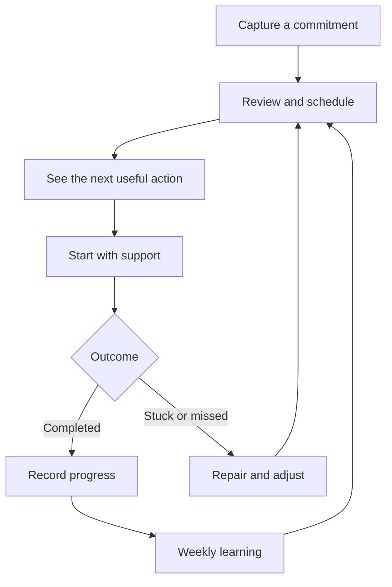
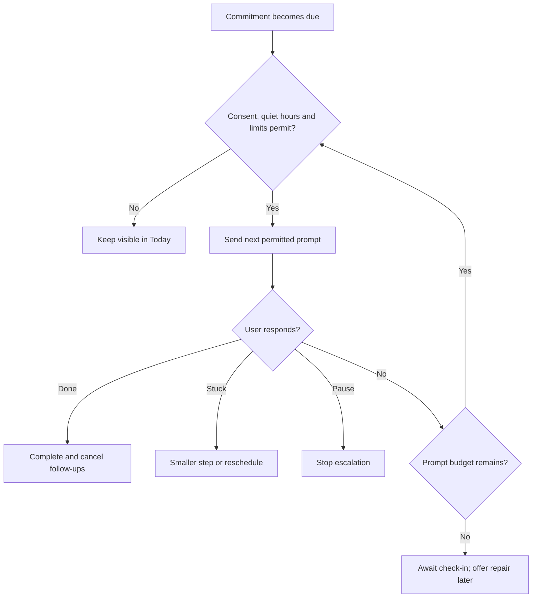
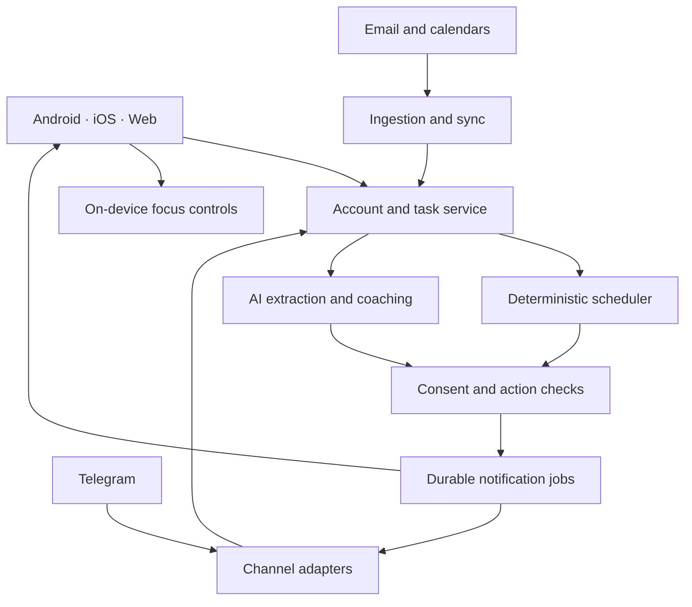

# Directive — Final Product Plan

**Filename:** `project-plan.md`  
**Research checked:** 6 September 2026  
**Status:** Approved product specification; app development, device prototypes, and external approvals remain pending.

This document consolidates v1, v2, feasibility research, and the founder's confirmed decisions. It is the planning source of truth; both original blueprints are preserved for reference. Published policies and prices below are dated research findings, not permanent guarantees.

**Contents:** [Vision](#1-product-vision-and-confirmed-direction) · [App experience](#2-how-the-app-should-feel-and-work) · [Feasibility](#3-feasibility-findings-and-technical-boundaries) · [Delivery and business](#4-delivery-phases-and-business-viability) · [Acceptance and verification](#5-acceptance-tests-and-final-deliverable)

## 1. Product vision and confirmed direction

**Directive helps people remember commitments, build a realistic day, start difficult tasks, and recover when plans go wrong.**

It combines an executive assistant's organization with a coach's accountability. Its value is the complete journey from “I need to do this” to “I did it”—including the moments when the user forgets, avoids, or becomes overwhelmed.

### Confirmed founder decisions

| Area | Decision |
|---|---|
| Audience | Working adults, adult students, and people who frequently forget commitments |
| Age | 18+ initially |
| Platforms | Android, iOS, and web |
| Reach | Global ambition; country-specific availability where required |
| Language | English initially; global time zones and local date/time formats |
| Communication | Directive chat and push first; optional Telegram |
| Scheduling | Bounded autopilot with explanations and undo |
| Accountability | Firm, with accessible pause and emergency escape |
| Business model | Free basics; paid AI and advanced automation |
| Delivery resources | Small team of approximately 2–4 builders |
| Accepted additions | Voice/widget capture, preparation checklists, small starting steps, weekly review, accountability partners |
| Later features | Automated calls and real-money stakes, subject to separate approval gates |

### What changes from v1 and v2

| Original direction | Final treatment |
|---|---|
| Persistent accountability | Retained with finite reminders, quiet hours, and user-controlled limits |
| Assistant primarily inside messaging apps | Own app is the foundation; external messaging extends it |
| AI decides whether an excuse is valid | AI helps identify the obstacle and negotiate a next step; the user retains control |
| Hostile escalation | Replaced with firm, respectful coaching |
| App blocking | Retained as an explicitly configured commitment tool |
| Deletion means deliberate avoidance | Removed; device disconnection is uncertain evidence |
| Proof of completion | Reframed as optional supporting evidence |
| Excuse Ledger | Renamed **Patterns & Adjustments** |
| Dopamine Detox Dashboard | Replaced with measurable progress and focus reporting |
| Automatically handling missed commitments | Drafting retained; sending requires approval |
| Financial penalties | Preserved as a later, separately reviewed product feature |

**Positioning:** trustworthy scheduling, memory support, and adaptive accountability in one experience.

Aggregation and scheduling alone are not an established market gap: Motion already offers automatic scheduling, while Akiflow provides extensive integrations and an AI assistant. Directive must demonstrate better execution support through testing rather than claim competitors lack these capabilities. [Motion](https://www.usemotion.com/help/time-management/auto-scheduling), [Akiflow integrations](https://akiflow.com/integrations), [Akiflow assistant](https://product.akiflow.com/help/articles/5284502-your-inbox)

## 2. How the app should feel and work

### The everyday loop



**Diagram in words:** Capture → schedule → see the next action → start → complete or repair → learn and adjust the plan.

The interface should feel calm and direct: readable text, generous spacing, optional dark mode, accessible controls, and short coaching messages. Avoid shame-based colors, public rankings, and overwhelming task counts.

### Main screens

| Screen | Purpose |
|---|---|
| **Today** | Current task, next two commitments, preparation alerts, and quick actions |
| **Inbox** | Captured ideas and extracted tasks awaiting review |
| **Plan** | Day/week calendar, priorities, deadlines, available capacity |
| **Coach** | Conversation, task breakdown, negotiation, and “Help me reset” |
| **Progress** | Habits, completed commitments, recovery patterns, weekly review |
| **Settings** | Boss Mode, integrations, partner sharing, privacy, billing |

On mobile, keep Today, Plan, Coach, and Inbox immediately accessible. Web provides a larger planning workspace. Core task management and coaching work on all three platforms; device controls remain platform-specific.

Example Today screen:

```text
DIRECTIVE                         Today

Your next step
Submit the project proposal
25 minutes • Due tomorrow

Start small: Open the draft and write 3 bullets.

[ Start ]  [ Make it smaller ]  [ Reschedule ]

Coming up
14:00  Study session
17:30  Leave for the gym

[ + Capture ]                 [ Help me reset ]
```

### Onboarding

1. Choose work, study, personal routines, or a combination.
2. Set time zone, available hours, sleep/quiet hours, and planning preferences.
3. Choose coaching tone and maximum accountability intensity.
4. Optionally disclose support needs; diagnosis disclosure is never required.
5. Add the first commitments and connect a calendar if useful.
6. Request notifications, email access, location, or blocking permissions only when their corresponding features are enabled.
7. Preview the proposed day and complete a first small action.

Start with useful manual functionality even when every optional permission is declined.

### Core features

| Feature | Final behavior |
|---|---|
| **Fast capture** | Add tasks through text, voice, mobile widgets, share sheets, web, or Telegram |
| **Unified tasks** | Work, study, personal tasks, recurring routines, subtasks, deadlines, duration, and priorities |
| **Memory support** | Preparation checklists, advance reminders, “leave now” prompts, and links to needed materials |
| **Smart ingestion** | Extract candidate commitments from explicitly connected Gmail/Outlook sources |
| **Transparent scheduling** | Fit flexible tasks around calendar events, working hours, breaks, and deadlines |
| **Next-action view** | Show one current action and a small preview; retain access to the full plan |
| **Starting help** | Turn an overwhelming task into a concrete two-minute first step |
| **Focus sessions** | Timer, chosen distraction rules, and an optional completion check-in |
| **Adaptive coach** | Adjust tone using direct conversation, user preferences, and task patterns |
| **Recovery** | Help the user reschedule, reduce scope, or consciously drop a commitment |
| **Weekly review** | Summarize what worked and propose one useful adjustment |
| **Accountability partners** | Share selected commitments with a mutually consenting trusted person |

Voice input must show an editable transcript. No continuous listening. Initial departure reminders use user-entered preparation/travel buffers; live traffic prediction is deferred.

The original **Dopamine Interceptor** becomes optional distraction check-ins during scheduled focus sessions. Where supported and authorized, on-device usage thresholds for user-selected distracting apps trigger a local prompt to return or start a smaller action; raw usage data is not assumed available to the cloud coach. Start with the original 20-minute threshold as an editable beta default. These proactive prompts share the reminder budget and do not trigger extra cross-channel escalation automatically.

### Scheduling and ingestion rules

- Distinguish **fixed events**, **flexible tasks**, and **recurring routines**.
- Automatically move flexible tasks only within approved availability.
- Preserve deadlines, pinned blocks, dependencies, and minimum working chunks.
- Start with a configurable capacity buffer of 20% of otherwise available time.
- If the workload cannot fit, explain the conflict and offer prioritization choices.
- Show why a task moved and provide undo.
- Ask before changing recurring routine times, sharing information, or altering meetings involving other people.
- Never automatically move medication schedules.

Email extraction produces reviewable candidates with source links and highlighted dates. Ambiguous deadlines require clarification. Accepted tasks enter scheduling automatically; unreviewed suggestions do not.

Initial email ingestion covers message text and user-selected folders/labels or sources. Broad attachment interpretation and enterprise-wide access are deferred. Filtering limits Directive's processing; it must not misrepresent the underlying OAuth permission breadth.

Connect Google Calendar and Outlook Calendar. Read selected calendars for availability and write Directive's task blocks to a designated calendar. External edits must reconcile without creating duplicate events. [Microsoft permissions](https://learn.microsoft.com/en-us/graph/permissions-reference)

### Accountability, reminders, and Boss Mode

**Tone and enforcement permissions are separate settings.** Wanting a firm coach does not automatically authorize app blocking or partner alerts.

Proposed initial reminder defaults:

| Setting | Default |
|---|---|
| Initial prompt | At the scheduled start |
| First follow-up | After 10 minutes without acknowledgement |
| Final follow-up | After another 20 minutes |
| Per-task limit | Three proactive prompts per occurrence |
| Daily limit | Six proactive coaching/reminder prompts across channels |
| Adjustable maximum | Twelve daily prompts, explicitly confirmed |
| Quiet hours | 22:00–08:00 local time, editable during onboarding |
| External fallback | Off until connected and enabled |

These are beta defaults to evaluate, not evidence-backed optimal frequencies.

Use push first, Telegram second when enabled, and optional email as the final launch fallback. Skip unavailable channels; never send the same escalation simultaneously everywhere. Acknowledgement or completion cancels pending follow-ups.



**Diagram in words:** Check permission, quiet hours, and limits before each prompt. A response completes, repairs, or pauses the commitment. Silence permits another scheduled prompt only while the budget remains; otherwise stop and await a check-in.

Follow-ups wait for the configured intervals; the diagram's loop is not immediate retrying. Conversational replies requested by the user do not count as proactive prompts. Preparation reminders count toward the proactive budget. Partner notifications have their own explicit grant and are not an automatic step in the user's escalation waterfall.

Additional rules:

- Ask for a brief postponement reason and offer a smaller action.
- Do not require the AI to approve an emergency or decide whether a user is truthful.
- Lowering intensity takes effect immediately; increasing it requires confirmation.
- Distress signals soften coaching and suspend firm escalation.
- Focus blocks activate only under explicitly accepted session rules.
- Emergency unlock remains available without AI permission.
- Essential communication, authentication, navigation, and Directive's own controls must remain accessible.
- No unlimited nagging, insults, or escalating financial consequences.

**SMS is excluded from behavioral reminders.** Account verification may use SMS later if needed; launch authentication should not depend on it.

### Recovery, habits, and wellbeing

After a missed or unconfirmed commitment, offer a short repair flow:

**What happened → What is realistic now → Adjust, restart, or drop it.**

Rename the Excuse Ledger to **Patterns & Adjustments**. After three similar user-reported obstacles within 30 days, propose an adjustment; require approval before modifying a recurring routine.

Include:

- Flexible habit targets such as three gym visits per week.
- Optional streaks with planned rest days.
- Recognition of restarting and completing smaller steps.
- A “Help me reset” flow with breathing, grounding, an optional short puzzle, or a replacement activity.
- A selectable short reset timer, without claiming every urge ends in ten minutes. [VA urge-surfing guidance](https://www.mirecc.va.gov/MIRECC/visn5/EBT/CBT-SUD/Urge-Surfing.asp)

Show completed commitments and recorded focus time directly. Label reduced screen time as a comparison with a baseline, not proven “hours reclaimed” or a measurement of dopamine.

### Default categories

| Category | Included behavior |
|---|---|
| Work and study | Deadlines, preparation, subtasks, focused work blocks |
| Gym | Session planning, packing checklist, optional location check-in |
| Meditation | Timer and optional guided exercise |
| Medicine | User-set reminders and self-reported completion; optional photo/barcode ritual |
| Meetings | Preparation alerts, join links, chosen focus rules |
| Health routines | Hydration, sleep preparation, and other user-defined routines |
| Birthdays and anniversaries | Reminders and editable message drafts |
| Shopping | Lists and optional proximity alerts during chosen errand windows |

A photo of medicine cannot verify ingestion; presence at a gym cannot verify exercise. Evidence is a personal accountability aid. Medication reminders do not provide dosage advice, automatic catch-up instructions, or guaranteed medical monitoring.

### Communication repair and partners

For a missed meeting or deadline, Directive can draft a concise explanation or rescheduling request. The user verifies recipients, facts, and proposed times, edits the draft, and explicitly sends it. Never invent an excuse or infer permission to contact a manager.

For accountability partners:

- The user sends an invitation link; the partner accepts.
- Both consent to the relationship.
- Share only selected task titles, agreed times, and status.
- Automatic missed-check-in alerts require explicit configuration for that commitment.
- Describe missing confirmation as **“check-in pending”**, not proven failure.
- Never share private coaching messages, diagnoses, email contents, location, or evidence photos by default.
- Partners cannot change schedules, increase intensity, or enforce lockouts.
- Either person can stop sharing immediately.

## 3. Feasibility findings and technical boundaries

The core product is feasible. Blocking, ingestion, and external messaging require permissions and review; they cannot be promised as unrestricted capabilities.

### Verification matrix

| Capability | Assessment | Final decision |
|---|---|---|
| Tasks, reminders, chat, coaching, scheduling | Technically feasible; effectiveness requires testing | Core release |
| Gmail ingestion | Feasible with OAuth verification and potentially substantial security work | Start approval work early |
| Outlook ingestion/calendar | Feasible through delegated permissions; organizational policies may restrict access | Core integration with clear connection status |
| Telegram bot | Feasible after the user initiates contact, subject to limits | Optional core channel |
| WhatsApp AI assistant | Significant eligibility and regional uncertainty | Conditional later integration |
| Instagram messaging | Not established as a dependable proactive channel in this review | Deferred pending policy/API validation |
| X messaging | API exists; automation rules and economics require product-specific validation | Deferred |
| iMessage bot | No validated delivery route established for this product | Not a committed integration |
| iOS blocking | Feasible conditionally through Screen Time frameworks and entitlement approval | Native capability gate |
| Android blocking | Conditional on implementation and Play policy compliance | Explicit user rules; review gate |
| Blocking desktop apps from a website | Outside browser capabilities | Dedicated desktop companion deferred |
| Scheduled geofencing | Feasible but permission-, battery-, and OS-dependent | Optional; manual check-in fallback |
| Reliable uninstall/cheating detection | Not supported by available signals | Remove this claim |
| Automated calls | Technically possible; country-specific consent and provider work required | Later gated pilot |
| Financial stakes | Technically possible; legal, payment, dispute, and verification questions unresolved | Later gated discovery |

### Important corrections backed by current sources

**WhatsApp:** current terms restrict AI providers when AI is the primary functionality and identify EEA/Brazil exceptions. Directive's classification is not established by this research. Neither “personal assistant” positioning nor a conversational window guarantees eligibility or free usage. Obtain product-specific guidance before development. [WhatsApp terms](https://www.whatsapp.com/legal/business-solution-terms?lang=en)

**Telegram:** users must first initiate contact with the bot. Implement account linking, opt-out, queuing, and rate-limit handling. [Telegram introduction](https://core.telegram.org/bots), [Telegram limits](https://core.telegram.org/bots/faq)

**iOS:** individual Screen Time authorization supports personal productivity use, but users can revoke authorization or delete the app. Distribution requires Apple's entitlement approval. Keep usage analysis on-device unless a permitted sharing mechanism is specifically validated. [Apple Screen Time](https://developer.apple.com/videos/play/wwdc2022/110336/), [entitlement requirements](https://developer.apple.com/documentation/FamilyControls/requesting-the-family-controls-entitlement)

**Android:** Google distinguishes deterministic automation from prohibited autonomous Accessibility-based planning and execution. Directive's AI may propose a focus rule; the user explicitly enables the rule and the device executes it deterministically. Approval is not guaranteed. [Google Play policy](https://support.google.com/googleplay/android-developer/answer/10964491?hl=en)

**DND:** retain the decision to respect device settings. V2's blanket explanation about both operating systems is too broad: Android exposes user-granted notification-policy access. Directive will offer OS allowlisting instructions rather than automatically changing DND. [Android documentation](https://developer.android.com/reference/android/app/NotificationManager)

**Device disconnection:** invalid push tokens can indicate uninstall, expiry, or configuration problems. Record “device unreachable,” never deliberate avoidance. Independently authorized channels may continue within their existing limits; disconnection does not increase intensity. [Firebase error documentation](https://firebase.google.com/docs/cloud-messaging/error-codes)

**Gmail:** read access uses restricted scopes, and transmitting or storing restricted data on servers requires a security assessment. Keep a manual share/paste route available while integration approval is pending. [Google scope requirements](https://developers.google.com/workspace/gmail/api/auth/scopes)

**Geofencing:** background events can arrive late. Absence of an event is not proof of absence; do not penalize it. Shopping proximity alerts also need explicitly bounded location windows. [Android geofencing](https://developer.android.com/develop/sensors-and-location/location/geofencing)

**Calls and money:** AI-generated voice falls within the FCC's artificial/prerecorded-voice framework. Calls require market-specific review. Payment providers also impose restrictions beyond local legality; a commitment-stakes product needs explicit provider acceptance. [FCC discussion](https://docs.fcc.gov/public/attachments/FCC-24-84A1.pdf), [Stripe restrictions](https://stripe.com/legal/restricted-businesses)

Financial incentives have evidence in specific settings, including smoking cessation, but that does not establish that AI-administered penalties improve everyday productivity. [Randomized trial](https://pmc.ncbi.nlm.nih.gov/articles/PMC4471993/)

### System structure and interfaces



**Diagram in words:** All clients and integrations share task state. Scheduling and AI proposals pass through consent checks. Durable jobs deliver notifications through the allowed channels; native device components apply accepted focus rules.

This is a logical overview, not an exhaustive network or security diagram. Authenticated task/calendar mutations and local focus-rule changes also require their applicable authorization checks; the notification path is not the only protected path.

Use a shared backend and task model, with native Swift/Kotlin components for OS-specific features. Keep scheduling and permission enforcement independent of the language model.

Minimum shared records:

| Record | Purpose |
|---|---|
| Task / occurrence | Commitment, recurrence, status, deadline, estimated effort |
| Schedule block / change | Planned time, constraints, explanation, undo history |
| Source reference | Email/calendar origin and deduplication identity |
| Coaching preferences / consent | Allowed tone, channels, sharing, and enforcement |
| Notification attempt | Reminder identity, channel, status, expiry |
| Partner grant | Explicitly shared commitments and alert permissions |
| Evidence check-in | User report or optional supporting observation |

All clients use authenticated task/schedule interfaces. Provider webhooks are verified. Mutations carry stable identities so retries do not duplicate tasks, messages, or calendar events.

Treat incoming email and messages as untrusted content: embedded instructions cannot authorize sends, reveal data, or alter permissions.

### Privacy and reliability defaults

- Encrypt stored data and OAuth tokens; exclude message bodies and sensitive details from routine logs.
- Process only explicitly connected sources.
- Provide editable assistant memory, export, deletion, and integration revocation.
- Prefer storing tone preferences over diagnoses.
- Delete raw voice and evidence uploads after processing by default; retain only the necessary task/check-in record.
- Keep location processing on-device where possible; do not build movement histories.
- Cache tasks and scheduled reminders for offline use; clearly show pending synchronization.
- Local pause/unlock works offline. Server-side pause applies when received; disclose the temporary synchronization boundary.
- Never replay a backlog of expired nudges after reconnecting.
- Stop new coaching sends after account deletion or consent revocation; disclose that provider-accepted messages may already be in transit.

## 4. Delivery phases and business viability

### Release sequence

| Phase | Deliverable | Exit condition |
|---|---|---|
| **0 — Feasibility prototypes** | Test iOS/Android controls, Telegram linking, calendar sync, ingestion permissions, scheduling, and costs | Approval dependencies documented; device prototypes work |
| **1 — Core beta** | Android/iOS/web tasks, Today, planning, chat, notifications, Boss Mode, starting help, repair flow, basic routines | End-to-end daily loop passes reliability checks |
| **2 — First full release** | Approved email integrations, voice/widgets, preparation checklists, Telegram, progress review, partners, approved mobile focus controls, optional evidence/geofencing | Accepted feature set validated on supported devices |
| **3 — Conditional expansion** | WhatsApp and other channels, additional languages/connectors, desktop blocking, calls, financial stakes | Separate capability-specific approval and viability gates |

A denied entitlement or integration approval must produce an honest capability limitation, not an unofficial workaround. The core app remains independently useful.

Native blocking on both mobile platforms is an intended full-release feature, conditional on approval. If unavailable, ship the unaffected platform/core beta and label blocking unavailable rather than claim equivalent enforcement.

Global ambition does not mean every feature is available in every country on day one. Maintain an explicit country/capability availability register and enable each market only after its distribution, privacy, billing, and support requirements are addressed.

### Free and paid boundaries

| Free | Paid |
|---|---|
| Manual tasks, recurring reminders, Today, manual planning, basic progress | AI coaching, task breakdown, email extraction, scheduling autopilot, adaptive reviews |
| Pause, emergency unlock, privacy controls, export/deletion | Advanced focus automation and integrations |
| Receive partner invitations and view accepted shared commitments | Create automated partner workflows |
| Existing task access after cancellation | Clearly disclosed AI usage allowance |

Do not fund the business through missed-task penalties or behavioral-data advertising. Essential control and privacy features remain available regardless of subscription status.

Set final subscription prices after the capped beta cost review; this is a commercial launch gate, not a prerequisite for implementing the agreed product behavior.

### Unit economics

Track:

```text
Monthly cost per active user =
AI input/output and voice processing
+ messaging and email
+ infrastructure and storage
+ integration/security costs allocated per user
+ support, billing fees, and refunds
```

Illustrative calculations using the published rates checked on the research date and a 30-day month:

| Scenario | Example monthly cost |
|---|---:|
| 400,000 input + 40,000 output text tokens/day at Gemini 2.5 Flash-Lite standard rates | $1.68 |
| 40 total WhatsApp messages/day through Twilio at $0.005 each | $6.00 handling fees alone |

Calculation details: `(0.4 × $0.10 + 0.04 × $0.40) × 30 = $1.68` for text tokens; `40 × $0.005 × 30 = $6.00` for WhatsApp handling.

These are arithmetic examples, not a model-quality endorsement or complete operating-cost estimate. Voice, retries, stronger models, Meta charges, and other services are additional. [Google pricing](https://ai.google.dev/gemini-api/docs/pricing), [Twilio pricing](https://www.twilio.com/en-us/whatsapp/pricing)

Use deterministic reminder templates, bounded conversation context, source deduplication, and per-user usage budgets. Do not invoke an AI model for every timer or notification.

Before paid launch, measure typical and heavy-user costs and target at least 70% contribution margin on net receipts after variable service costs. Display allowances clearly and never introduce surprise overage charges.

### Explicitly deferred or excluded scope

| Item | Treatment |
|---|---|
| Private conversations with other people | Permanently excluded from emotional-state inference; authorized email task extraction remains separate |
| DND bypass without device-level consent | Excluded; optional OS allowlisting guidance only |
| Unbounded reminders, hostile coaching, AI-denied emergency exits | Excluded |
| Diagnosing or treating ADHD, anxiety, depression, or addiction | Excluded from the productivity product |
| Slack, Jira, Trello, and other work-task connectors | Phase 3 candidates; individually validate APIs, scopes, and demand before commitment |
| Live traffic-based departure predictions | Deferred; first release uses user-entered buffers |
| Charity donations inside the urge/reset flow | Excluded from the first release; any future money transfer requires separate consent and provider review |
| Calls and real-money stakes | Phase 3 discovery; no committed country rollout or automatic loss adjudication |
| Minor/guardian accounts, employer monitoring, public leaderboards | Outside the agreed initial adult personal-assistant scope |

## 5. Acceptance tests and final deliverable

### Functional and reliability checks

| Scenario | Required result |
|---|---|
| Ambiguous email deadline | Candidate remains reviewable; no invented deadline |
| Duplicate provider webhook | One task or action |
| Overloaded day | Conflict explained; fixed events and sleep boundaries preserved |
| Task rescheduled automatically | Explanation and undo available |
| Recurring routine adjustment | Explicit approval required |
| Task completed through Telegram | Other clients synchronize; pending nudges cancel |
| Notification permission denied | Core app remains usable; no delivery guarantee |
| Quiet hours, travel, daylight-saving change | Correct local scheduling; no unintended escalation |
| Offline device or invalid token | Unknown/unreachable status; no accusation or penalty |
| Revoked blocking permission | Accurate status and functioning manual focus alternative |
| Emergency unlock or lower Boss Mode | Immediate local relief without AI approval |
| Repeated distress | Softer coaching; firm escalation stops |
| Calendar/email connection revoked | Synchronization stops and status is visible |
| Draft edited after approval | Reapproval required before sending changed content |
| Partner access revoked | Shared view and unsent alerts stop |
| Email contains malicious instructions | No unauthorized tool action or disclosure |
| Location/photo unavailable | Manual check-in offered |
| AI/provider outage | Existing tasks and deterministic reminders continue |
| Subscription expires | Existing task access and safety/privacy controls remain |
| Cross-device duplicate completion | Single consistent occurrence state |

Test Android and iOS behavior on physical devices, including background restrictions and permission revocation. Browser simulations are insufficient for mobile enforcement claims.

### Product validation

Run a four-week adult beta across working, studying, and forgetfulness-focused users. Compare with their initial baseline.

Measure:

- Commitments completed and important commitments missed.
- Time from planned start to actual start.
- How often users restart after a miss.
- Schedule changes accepted versus undone.
- Perceived helpfulness and pressure.
- Notification opt-outs and partner-sharing complaints.
- Ingestion accuracy and reminder dispatch failures.
- Typical and heavy-user operating cost.

The intended outcome is more follow-through with manageable pressure. Message replies, streak length, and time spent chatting are secondary signals.

### Blueprint coverage audit

| Source feature family | Where it is resolved | Disposition |
|---|---|---|
| Aggregation, priority list, scheduling, one task at a time | Core features; Scheduling and ingestion rules | Retained and specified |
| Snooze defense, escalating prompts, tough love | Accountability, reminders, and Boss Mode | Redesigned with user limits and escape |
| DND override and app lockout | Feasibility corrections; Accountability rules | Override excluded; approved mobile blocking retained |
| WhatsApp/iMessage/Instagram/X coaching | Founder decisions; Verification matrix | App-first and Telegram; other channels conditional or uncommitted |
| SMS and phone calls | Accountability rules; Release sequence | Behavioral SMS excluded; calls deferred |
| Chameleon Persona and condition disclosure | Onboarding; Adaptive coach; Privacy defaults | Retained using direct signals, without diagnosis |
| Emotional inference from others' private chats | Explicitly deferred or excluded scope | Permanently excluded |
| Apology/rescheduling emails | Communication repair and partners | Draft, review, approve, then send |
| Email deadlines/forms and calendars | Scheduling and ingestion rules | Reviewable extraction and bounded calendar automation |
| Screen-use intervention and distraction blocking | Focus sessions; iOS/Android feasibility | Permission-gated native rules; no universal surveillance claim |
| SOS, urge surfing, replacement activities | Recovery, habits, and wellbeing | Retained as a reset flow without fixed-duration claims |
| Donation-based distraction | Explicitly deferred or excluded scope | First-release exclusion |
| Time reclaimed, Excuse Ledger, schedule redesign | Recovery, habits, and wellbeing | Measurable progress and approved pattern adjustments |
| GPS, barcode, and photo completion rituals | Default categories; Geofencing corrections | Optional supporting evidence with fallback |
| Gym, meditation, medicine, meetings, health, birthdays, shopping | Default categories | All retained with revised boundaries |
| Post-failure repair, streaks, gamification | Recovery, habits, and wellbeing | Retained without punitive comparison |
| Financial stakes | Verification matrix; Release sequence | Later legal/provider/product discovery |
| Cross-channel waterfall and uninstall persistence | Accountability rules; Device disconnection | Finite, consent-bound waterfall; no cheating inference |
| Connector breadth from competitor comparison | Explicitly deferred or excluded scope | Additional task connectors deferred |
| Meta review, calling consent, economics, store policy | Feasibility findings; Delivery and business | Explicit launch/capability gates |
| New capture, preparation, starting help, reviews, partners | Core features; Communication repair and partners | Founder-approved first-full-release additions |

### Document verification and future updates

The deliverable is `C:\Users\tande\Projects\directives\project-plan.md`. The original blueprints remain unchanged. Mermaid diagrams include text descriptions so their meaning remains available in viewers without Mermaid support.

Document acceptance requires:

1. Every v1/v2 feature is retained, redesigned, deferred, or explicitly excluded.
2. Reminder, sharing, automation, and release rules agree throughout.
3. Markdown and Mermaid diagrams render readably, with working internal navigation.
4. Desk-researched feasibility remains separate from uncompleted prototypes, legal reviews, and provider approvals.
5. No planned app feature is labeled “implemented” until it has actually been built and verified.

Recheck time-sensitive policies, pricing, and provider eligibility before implementation of each gated integration and before commercial launch. The deferred commercial and regional decisions are explicit future gates, not claims of completed approval.
